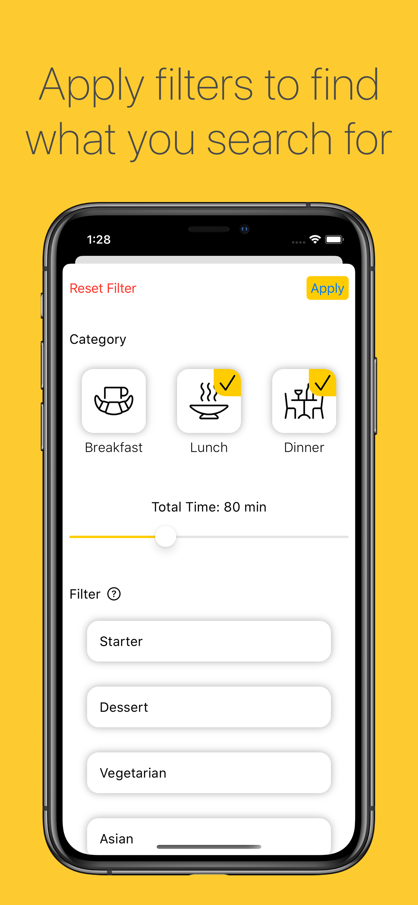
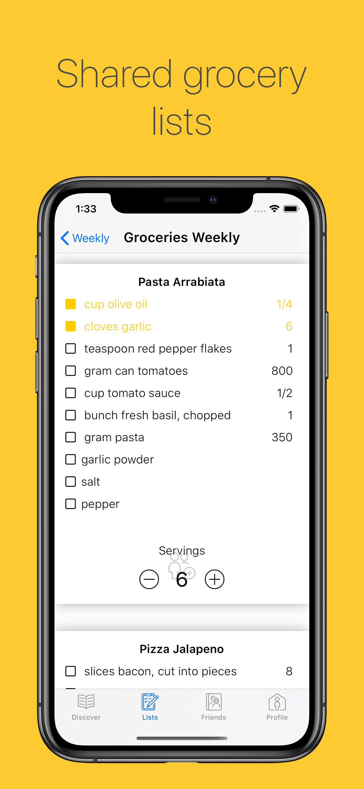
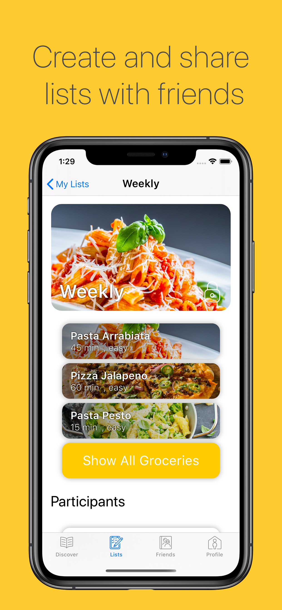
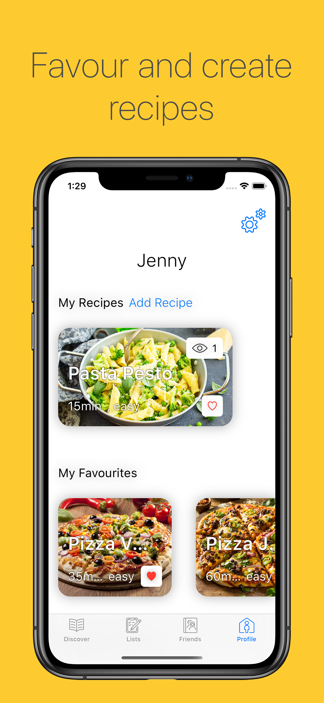
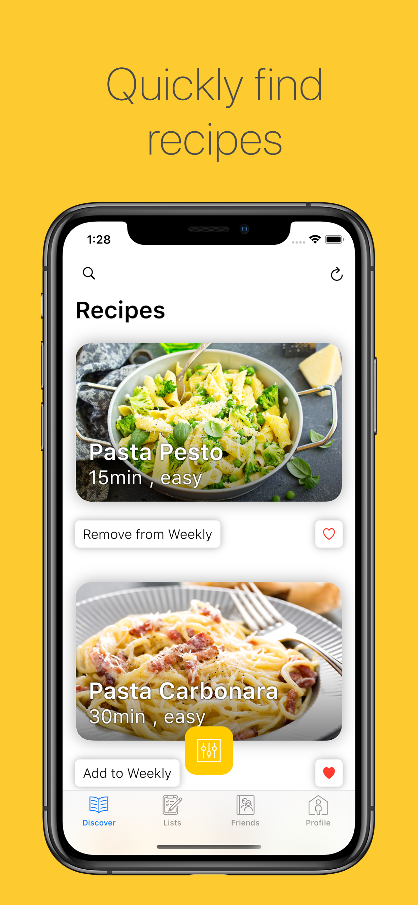

# Biteoff

Small side project I started druing COVID. \
My intention was to learn a little mobile development. Took it quite far with this project. There is a little of everything. Databases, mobile storage management, asynchronous calls, hardware acceleration etc.

*Because of assets/ icons and fonts that I used, of which I have the rights to use them but do not have the rights of redistributing them, I cannot make this repository public*.

Some images:
 <table style="width:100%">
  <tr>
    <th>

    </th>
    <th>
    
    </th>
  </tr>
  <tr>
    <td>
    
    </td>
    <td>
    
    </td>
  </tr>
  <tr>
    <td>
    
    </td>
    <td>
    
    </td>
  </tr>
</table> 
